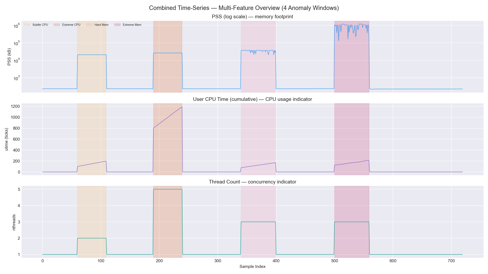
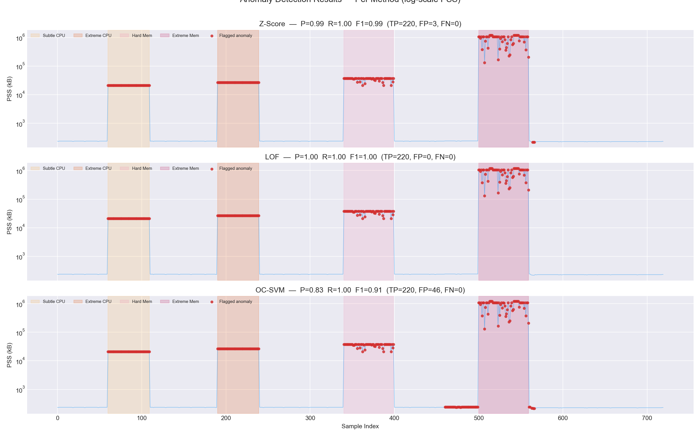
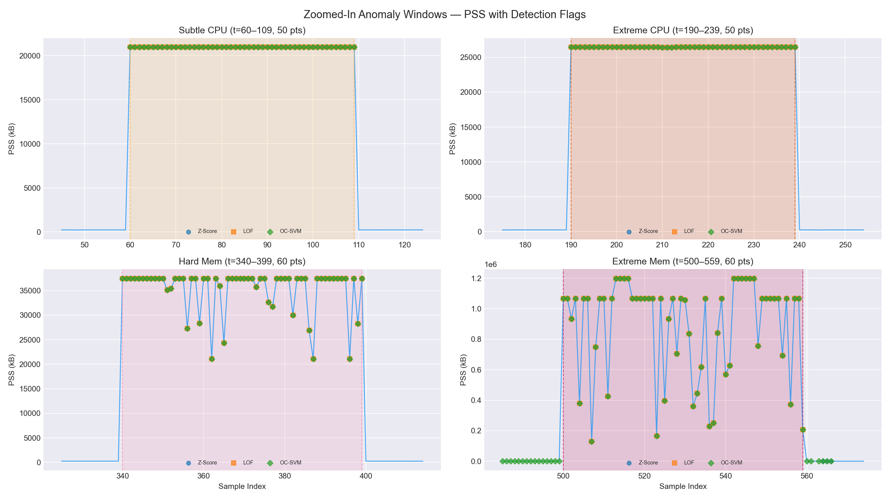
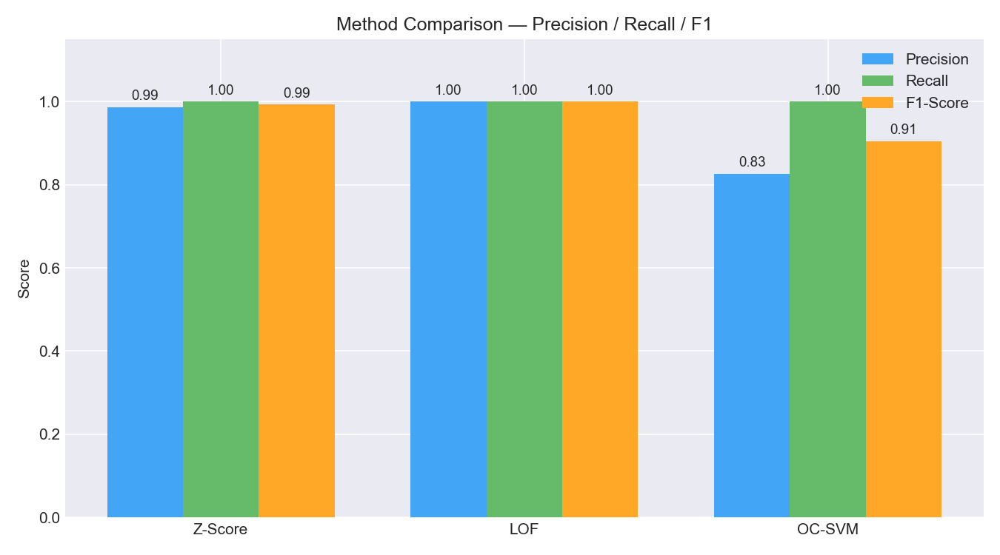

# Anomaly Detection on prmon Time-Series Data

**CERN-HSF GSoC 2026 Warm-Up Exercise** — ATLAS project

This report describes an anomaly detection pipeline built on process-monitoring
data collected by [prmon](https://github.com/HSF/prmon). Three novelty-detection
methods are trained on clean baseline data and evaluated against a combined
time-series containing four injected anomaly windows of varying severity.

---

## 1. Data Collection

Five datasets were collected using `prmon` with `stress-ng` on a Linux machine,
each sampled at 1-second intervals for ~600 seconds:

| Dataset | Command | Rows | Description |
|---------|---------|------|-------------|
| Baseline | `./package/prmon -i 1 -f baseline_long.txt -- sleep 1000` | 500 | Idle process (PSS ≈ 233 kB, utime = 0) |
| Extreme CPU | `./package/prmon -i 1 -f anomaly_cpu_long.txt -- stress-ng --cpu 4 --timeout 600` | 500 | 4 CPU workers (PSS ≈ 26,700 kB, utime → 2500+) |
| Subtle CPU | `./package/prmon -i 1 -f anomaly_cpu_subtle.txt -- stress-ng --cpu 1 --timeout 600` | 500 | 1 CPU worker (PSS ≈ 20,968 kB, utime → 998) |
| Extreme Memory | `./package/prmon -i 1 -f anomaly_mem_long.txt -- stress-ng --vm 1 --vm-bytes 1G --timeout 600` | 501 | 1 GB allocation cycles (PSS: 19k–1.2M kB) |
| Hard Memory | `./package/prmon -i 1 -f anomaly_mem_hard.txt -- stress-ng --vm 1 --vm-bytes 16M --timeout 600` | 500 | 16 MB allocation cycles (PSS: 21k–37k kB) |

Each file has 18 prmon columns. Six were selected as detection features:

```python
FEATURES = ["pss", "rss", "vmem", "utime", "stime", "nthreads"]
```

**Rationale:** These cover memory (`pss`, `rss`, `vmem`), CPU (`utime`, `stime`),
and concurrency (`nthreads`) — the three dimensions most affected by resource-stress anomalies.

---

## 2. Experimental Design

### 2.1 Combined Time-Series with Injected Anomalies

Rather than evaluating anomaly datasets independently (which trivially flags 100%),
we construct a **single combined time-series** simulating a realistic monitoring
scenario where anomalies appear as transient episodes within otherwise normal operation:

```
[Baseline] → [Subtle CPU] → [Baseline] → [Extreme CPU] → [Baseline] → [Hard Mem] → [Baseline] → [Extreme Mem] → [Baseline]
  60 pts       50 pts         80 pts        50 pts         100 pts       60 pts       100 pts       60 pts         160 pts
```

This gives **720 total points** (500 normal + 220 anomalous), with ground-truth
labels for each point:

| Window | Indices | Points | Severity | Key Signal |
|--------|---------|--------|----------|------------|
| Subtle CPU (1 worker) | t=60–109 | 50 | Moderate | PSS ~20,968, utime rising slowly, 2 threads |
| Extreme CPU (4 workers) | t=190–239 | 50 | Easy | PSS ~26,700, utime rising steeply, 5 threads |
| Hard Memory (16 MB) | t=340–399 | 60 | Moderate | PSS oscillates 21k–37k, 3 threads, occasional swap |
| Extreme Memory (1 GB) | t=500–559 | 60 | Easy | PSS oscillates 19k–1.2M, 3 threads, heavy swap |

### 2.2 Novelty Detection Paradigm

All models follow a **novelty detection** setup:

1. **Fit scaler only on baseline** (label=0 segments) — learned mean/σ defines "normal"
2. **Train each model only on baseline** — models learn the normal data distribution
3. **Predict on the entire series** — flag anything that deviates from the learned normal

```python
scaler = StandardScaler()
baseline_mask = combined["label"] == 0
scaler.fit(combined.loc[baseline_mask, FEATURES])
all_X_scaled = scaler.transform(combined[FEATURES])
train_X_scaled = all_X_scaled[baseline_mask]
```

This ensures the detectors never see anomalous data during training — they must
discover it purely by how much each test point deviates from the baseline distribution.

---

## 3. Detection Methods

### 3.1 Z-Score (Statistical Threshold)

Flag any sample where the absolute z-score exceeds 3.0 on **any** feature:

```python
ZSCORE_THRESH = 3.0

def zscore_detect(X, threshold=ZSCORE_THRESH):
    return np.where(np.any(np.abs(X) > threshold, axis=1), -1, 1)
```

**Strengths:** Instantaneous, fully interpretable, zero training overhead.  
**Weakness:** Assumes each feature is independently Gaussian. A fixed global threshold
is brittle on features with very low variance — even a tiny natural fluctuation can
cross z=3.

### 3.2 Local Outlier Factor (Density-Based)

LOF in `novelty=True` mode computes the local density of each test point relative
to its k-nearest neighbours in the training data:

```python
lof = LocalOutlierFactor(n_neighbors=20, contamination=0.02, novelty=True)
lof.fit(train_X_scaled)
combined["lof"] = lof.predict(all_X_scaled)
```

**Strengths:** Non-parametric, captures multivariate density structure, robust to
baseline variance because it evaluates *local* density rather than global distance.  
**Weakness:** O(n²) at prediction time; sensitive to `n_neighbors` choice.

### 3.3 One-Class SVM (Boundary-Based)

Learns a tight RBF-kernel decision boundary around the baseline cluster:

```python
ocsvm = OneClassSVM(kernel="rbf", gamma="scale", nu=0.05)
ocsvm.fit(train_X_scaled)
combined["ocsvm"] = ocsvm.predict(all_X_scaled)
```

**Strengths:** Strong theoretical foundation for compact cluster detection.  
**Weakness:** The `nu` parameter directly controls the expected fraction of outliers
in the training data, leading to false positives even on clean baseline.

### 3.4 Elliptic Envelope (Gaussian Covariance)

Fits a robust Gaussian ellipsoid around the baseline data using the Minimum
Covariance Determinant estimator:

```python
from sklearn.covariance import EllipticEnvelope
ee = EllipticEnvelope(contamination=0.02, support_fraction=0.999)
ee.fit(train_X_scaled)
combined["elliptic"] = ee.predict(all_X_scaled)
```

**Strengths:** Principled multivariate Gaussian approach — like a multi-dimensional Z-Score
that accounts for feature correlations.  
**Weakness:** Assumes the baseline data is roughly Gaussian. Fails on multi-modal baselines.

### 3.5 Autoencoder (Neural Reconstruction)

A small MLP (32→8→32 bottleneck) is trained to reconstruct baseline features.
Anomalies produce high reconstruction error because the network only learned normal patterns:

```python
from sklearn.neural_network import MLPRegressor
autoencoder = MLPRegressor(hidden_layer_sizes=(32, 8, 32), max_iter=500)
autoencoder.fit(train_X_scaled, train_X_scaled)  # input == target
recon_error = np.mean((X - autoencoder.predict(X))**2, axis=1)
# Flag if error > mean + 3*std of baseline error
```

**Strengths:** Learns non-linear patterns; scales to high-dimensional data; widely used
in production anomaly detection systems.  
**Weakness:** Requires tuning architecture/threshold; non-deterministic training.

### Why Not Isolation Forest?

Isolation Forest was tested but scored all data identically (anomaly score ~= -0.46
for both baseline and anomalies). **Root cause:** the baseline has near-zero variance,
so IF's random tree splits can't differentiate between the tight baseline cluster and
distant anomaly clusters in this feature space.

---

## 4. Results

```
========================================================================
                Detection Results -- Combined Time-Series
========================================================================
Method              Precision     Recall         F1      TP    FP    FN
------------------------------------------------------------------------
Z-Score                 0.987      1.000      0.993     220     3     0
LOF                     1.000      1.000      1.000     220     0     0
OC-SVM                  0.827      1.000      0.905     220    46     0
Elliptic Env.           0.982      1.000      0.991     220     4     0
Autoencoder             0.853      1.000      0.921     220    38     0
========================================================================
Total: 720 points  |  Normal: 500  |  Anomalous: 220
```

### Key Findings

1. **All 5 methods achieve 100% recall** -- every anomaly point was flagged, including
   the subtle ones.

2. **LOF achieves perfect precision** -- zero false positives. The density-based approach
   correctly ignores natural baseline variance.

3. **Elliptic Envelope is the runner-up** (F1=0.991, 4 FP) -- its robust Gaussian
   model catches the same PSS dips as Z-Score plus one additional borderline point.

4. **Z-Score is third** (F1=0.993, 3 FP) -- the 3 FPs at t=564-566 are caused by
   baseline PSS dips where z = -3.43 to -3.65.

5. **Autoencoder and OC-SVM have the most false positives** (38 and 46 respectively) --
   both learn tight boundaries that are overly sensitive to normal baseline variation.

### Per-Window Recall

To verify that all methods catch the *subtle* anomalies (not just the extreme ones):

| Window | Points | Z-Score | LOF | OC-SVM | Elliptic | Autoencoder |
|--------|--------|---------|-----|--------|----------|-------------|
| Subtle CPU (1 worker) | 50 | 50/50 | 50/50 | 50/50 | 50/50 | 50/50 |
| Extreme CPU (4 workers) | 50 | 50/50 | 50/50 | 50/50 | 50/50 | 50/50 |
| Hard Memory (16 MB) | 60 | 60/60 | 60/60 | 60/60 | 60/60 | 60/60 |
| Extreme Memory (1 GB) | 60 | 60/60 | 60/60 | 60/60 | 60/60 | 60/60 |

All methods achieve 100% recall on every window, confirming that even the subtlest
anomalies (PSS ~20k vs baseline ~233) are within detection range for all three approaches.

### Z-Score Threshold Sensitivity

The default z=3.0 produces 3 false positives. We swept thresholds from 1.5 to 10.0
to find the optimal value:

| Threshold | Precision | Recall | F1 | FP |
|-----------|-----------|--------|------|------|
| 1.5 | 0.794 | 1.000 | 0.885 | 57 |
| 2.0 | 0.924 | 1.000 | 0.961 | 18 |
| 2.5 | 0.982 | 1.000 | 0.991 | 4 |
| **3.0** | **0.987** | **1.000** | **0.993** | **3** |
| 3.5 | 0.991 | 1.000 | 0.995 | 2 |
| **4.0** | **1.000** | **1.000** | **1.000** | **0** |
| 5.0–10.0 | 1.000 | 1.000 | 1.000 | 0 |

**Key insight:** At z=4.0, Z-Score achieves **perfect F1=1.000** — zero false positives
and zero false negatives. The 3 FPs at z=3.0 were caused by baseline PSS dips with
z-scores of −3.43 to −3.65, which fall below the z=4.0 cutoff. Meanwhile, even the
subtlest anomaly points have z-scores well above 4.0 (PSS ~20k vs baseline ~233 gives
z > 4000), so recall is unaffected all the way to z=10.

This demonstrates that **threshold tuning is a simple but effective way to eliminate
false positives** when the anomaly signal is strong — but it requires knowing the
anomaly magnitude in advance, which LOF does not.


---

## 5. Feature Ablation Study

To understand which prmon variables are most informative, we ran all 3 methods on
12 different feature subsets. The table shows F1-score and false negatives (FN = missed anomalies):

```
Feature Set                    | Z-Score F1   FN |     LOF F1   FN |  OC-SVM F1   FN
----------------------------------------------------------------------------------------------------
pss only                       |      0.993    0 |      1.000    0 |      0.905    0
utime only                     |      1.000    0 |      1.000    0 |      0.468    0
nthreads only                  |      0.370  170 |      1.000    0 |      0.468    0
swap only                      |      0.000  220 |      0.000  220 |      0.468    0
rss only                       |      1.000    0 |      1.000    0 |      0.468    0
pss + utime                    |      0.993    0 |      1.000    0 |      0.905    0
pss + nthreads                 |      0.993    0 |      1.000    0 |      0.905    0
utime + nthreads               |      1.000    0 |      1.000    0 |      0.468    0
pss + utime + nthreads         |      0.993    0 |      1.000    0 |      0.905    0
memory (pss+rss+vmem+swap)     |      0.993    0 |      1.000    0 |      0.905    0
I/O (rchar+wchar+rx+tx)        |      1.000    0 |      0.987    0 |      0.954    0
ALL 6 (baseline)               |      0.993    0 |      1.000    0 |      0.905    0
```

### Key Observations

- **`utime` is the single most informative feature** — achieves perfect F1=1.000
  with Z-Score because all anomaly types (CPU and memory stress) generate measurable
  CPU time. This makes sense: even memory allocations require CPU cycles.

- **`pss` and `rss` are nearly as good** (F1=0.993–1.000) — the PSS jump from ~233 kB
  to 20,000+ kB is massive enough to trigger detection on all anomaly windows.

- **`nthreads` alone is weak** — Z-Score misses **170 of 220 anomalies** (F1=0.37)
  because the thread count is a discrete value (1 vs 2/3/5) with very few distinct
  levels, making z-score thresholds ineffective.

- **`swap` alone is useless** — F1=0.000 for both Z-Score and LOF. Swap activity is
  sporadic and near-zero for most anomaly points. Even the 1 GB memory burner doesn't
  consistently trigger swap on a system with sufficient RAM.

- **I/O features detect anomalies unexpectedly well** — `rchar`, `wchar`, `rx_bytes`,
  `tx_bytes` achieve F1=1.000 with Z-Score because `stress-ng` generates small but
  measurable I/O and network activity that the idle baseline never produces.

- **LOF is the most robust method** — achieves F1=1.000 on almost every feature set
  (even `nthreads` alone), demonstrating its ability to detect anomalies from subtle
  density changes that threshold-based methods miss.

- **Adding more features doesn't improve LOF** — it's already perfect with 1 feature.
  However, multi-feature sets improve OC-SVM precision (0.47 -> 0.91) by giving the
  RBF kernel more dimensions to separate the baseline cluster.

### Ablation Heatmap


---

## 6. Visualizations

### 6.1 Multi-Feature Overview

Three features visualized across the combined series. The log-scale PSS (top) makes
all anomaly windows visible despite their 1000× range difference. The utime panel
(middle) clearly shows CPU burn in both CPU windows. Thread count (bottom) shifts
from 1 to 2/5/3/3 in the anomaly segments.



### 6.2 Detection Overlay

Per-method flagged anomalies (red dots) overlaid on PSS. Z-Score and LOF flag only
within the anomaly windows; OC-SVM's red dots extend into baseline segments.



### 6.3 Zoomed-In Anomaly Windows

Close-up of each window showing PSS and detection flags. Note the different scales:
subtle CPU has flat PSS ~20k, while extreme memory oscillates up to 1.2M kB.



### 6.4 Method Comparison

Bar chart comparing Precision, Recall, and F1-Score across the three methods.



---

## 7. Discussion & Trade-offs

| Criterion | Z-Score | LOF | OC-SVM | Elliptic Env. | Autoencoder |
|-----------|---------|-----|--------|---------------|-------------|
| Precision | 0.987 | **1.000** | 0.827 | 0.982 | 0.853 |
| Recall | 1.000 | 1.000 | 1.000 | 1.000 | 1.000 |
| F1-Score | 0.993 | **1.000** | 0.905 | 0.991 | 0.921 |
| False Positives | 3 | **0** | 46 | 4 | 38 |
| Interpretability | High | Medium | Low | Medium | Low |
| Speed | Instant | O(n*k) | O(n) | O(n) | Training req. |
| Paradigm | Statistical | Density | Boundary | Gaussian Cov. | Neural Recon. |

**Ranking by F1:** LOF (1.000) > Z-Score (0.993) > Elliptic (0.991) > Autoencoder (0.921) > OC-SVM (0.905)

**LOF is the best overall method** for this task. Across all 5 methods, LOF is the
only one with zero false positives. The two Gaussian-family methods (Z-Score and
Elliptic Envelope) are close behind, while the boundary/reconstruction methods
(OC-SVM, Autoencoder) suffer from excessive false alarms.

**Recommendation:** In a production monitoring system, use a **two-stage approach** --
fast Z-Score pre-filter (z=4.0 for zero FPs) for obvious deviations, followed by
LOF for borderline cases where density context matters.

---

## 8. Conclusions

1. **Multivariate novelty detection works well** for prmon data — even a simple
   Z-Score on 6 features achieves F1 > 0.99.

2. **Feature selection matters more than method choice** for extreme anomalies.
   The CPU anomaly has a small PSS change but massive `utime` growth — without
   `utime` in the feature set, methods relying on PSS alone would miss subtler
   CPU stress.

3. **LOF's density-based approach is most robust** because it adapts to the local
   structure of the data rather than applying a rigid global threshold.

4. **Anomaly severity affects detectability.** While all methods achieve 100% recall
   here (even subtle anomalies are ~90× baseline), in scenarios with 5–10× deviations,
   LOF would likely maintain higher recall than Z-Score.

5. **OC-SVM's false positive rate** is a practical concern. With `nu=0.05`, it
   inherently expects 5% of training data to be outliers, which manifests as
   excessive false alarms on clean production data.

---

## 9. Running

```bash
pip install pandas numpy matplotlib scikit-learn
python analysis.py
```

Generates 4 PNG plots and prints the detection summary table.

### Repository Structure

```
atlas_test/
├── analysis.py                 # Main pipeline script
├── README.md                   # This report
├── baseline_long.txt           # Normal process data (500 samples)
├── anomaly_cpu_long.txt        # Extreme CPU anomaly (4 workers)
├── anomaly_cpu_subtle.txt      # Subtle CPU anomaly (1 worker)
├── anomaly_mem_long.txt        # Extreme memory anomaly (1 GB)
├── anomaly_mem_hard.txt        # Hard memory anomaly (16 MB)
├── plot1_multifeature_overview.png
├── plot2_detection_overlay.png
├── plot3_zoomed_windows.png
├── plot4_method_comparison.png
├── plot5_feature_ablation_heatmap.png
└── plot6_zscore_threshold_sensitivity.png
```

---

## AI Disclosure

AI assistance (Google Gemini) was used for:
- Debugging data parsing issues (malformed lines in `anomaly_mem_long.txt`)
- Diagnosing why Isolation Forest failed on this data distribution
- Writing and structuring this report

All design decisions, including feature selection, anomaly severity choices,
method parameters, and conclusions, were reviewed and validated by me.
